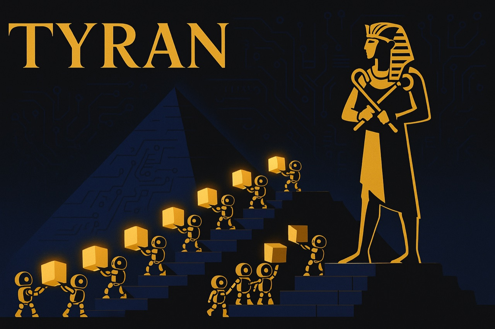
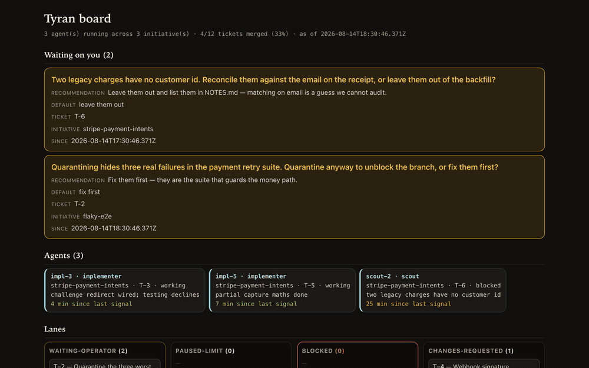
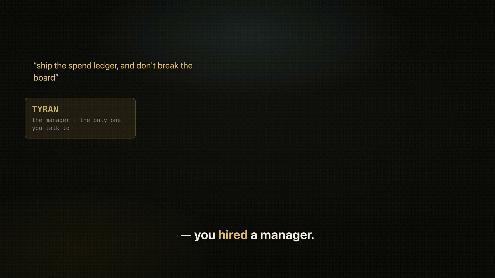
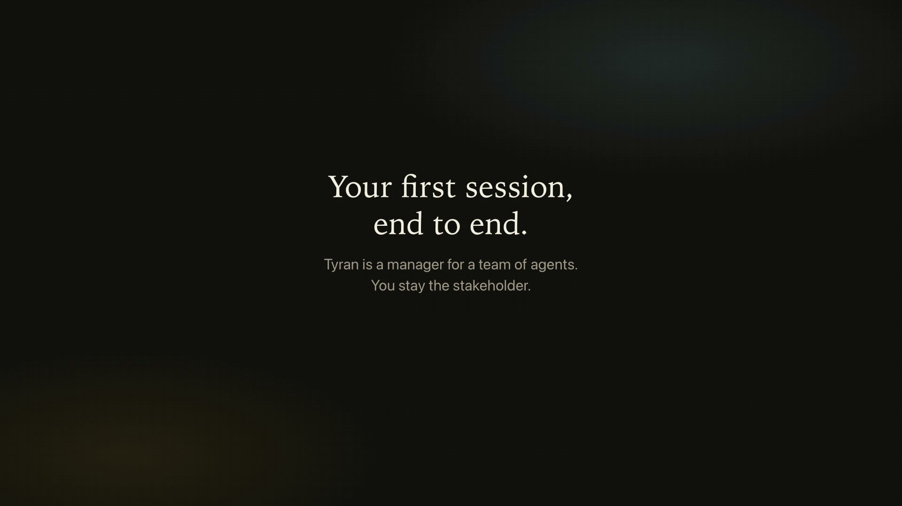

<p align="center">
  
</p>

<p align="center">
  <a href="https://github.com/jjanczur/tyran/actions/workflows/ci.yml"></a>
  <a href="https://github.com/jjanczur/tyran/actions/workflows/security.yml"></a>
  
  
  <a href="./LICENSE"></a>
  <a href="https://www.npmjs.com/package/@jjanczur/tyran"></a>
</p>

<p align="center">
  <b><a href="https://jjanczur.github.io/tyran/">📖 Documentation</a></b> ·
  <a href="https://jjanczur.github.io/tyran/getting-started/">Getting started</a> ·
  <a href="https://jjanczur.github.io/tyran/videos/">Videos</a> ·
  <a href="https://jjanczur.github.io/tyran/architecture/">Architecture</a> ·
  <a href="https://github.com/jjanczur/tyran/releases/latest">Releases</a>
</p>

<h3 align="center">The more you use it, the better it gets.</h3>

## What Tyran is

Your most expensive model just renamed a variable. In the same chat, it judged
an authentication boundary.

One chat, one model, every job — that is why the bill is high and the work gets
worse. The context fills up, the plan is somewhere in the scrollback, and
*"the tests pass"* is a sentence rather than something you can check.

**You didn't install a tool. You hired a manager.** You describe the work once;
he interviews you until the goal is unambiguous — batches of at most four
questions, each with his recommendation — turns the plan into tickets on a
board, and hands each piece to a **dedicated subagent with fresh context and a
model tier matched to how hard that piece actually is.** A good manager doesn't
put a principal engineer on a grep: a scout reads the repo on the cheap tier,
implementers take one story each on their own branch, the reviewer has no
editing tools at all, and security review always gets the strongest tier — a
floor no cost profile or flag can lower.

That is a cost lever and a quality lever at the same time. The conductor holds
the plan and never accumulates its agents' transcripts, which is where the
tokens in a long session actually go; and an agent that never saw the last six
failed attempts cannot inherit them, so the second opinion is a real one.

**Nothing you say is lost.** Remember something halfway through a run and say
it — it doesn't land in the scrollback, it becomes a ticket. Every decision,
spawn, report, merge and open question is appended to a journal **committed to
your repo**, so a restart, a compaction and a colleague on another branch all
read the same thing.

**It learns your repo while it works.** Setup reads how the repo is really
worked — stack, validation commands, how things get deployed — rather than
asking you to describe it. After every initiative the team runs a retrospective
on itself, and what it changes is Tyran, never your product code. The same
failure three times becomes knowledge pasted into every matching handoff; five
times and it becomes a rule in your `CLAUDE.md`, carrying the dates that earned
it. Most retros correctly change nothing.

All of it lands on one page — a **board**: what every agent is doing right now,
which questions are waiting on you (answer them there and the run carries on),
and what the work cost, in the tokens the platform itself reported, per model,
per agent and per ticket. The conductor gets its own row, so its overhead never
hides inside the total.

Underneath, **a hook decides before the tool ever runs** — none of this is a
prompt asking nicely. A report with no raw command output is refused: it blocks
silence, not forgery. Every write is classified against a policy file you own.
And a commit carrying a secret is refused, even inside a markdown file.
Mechanisms rather than instructions — which is the whole argument.

<p align="center">
  
</p>

<p align="center">
  <b><a href="https://jjanczur.github.io/tyran/sandbox/">▶ Open the sandbox board</a></b> —
  the real page with sample data, in your browser. Click the tabs, filter the
  lanes, select a card.
</p>

### Watch it

<table>
<tr>
<td width="50%" align="center">
  <a href="https://youtu.be/ThulYtbYNXI"></a><br>
  <b><a href="https://youtu.be/ThulYtbYNXI">You Didn't Install a Tool — You Hired a Manager</a></b><br>
  3:20 · the whole argument, end to end
</td>
<td width="50%" align="center">
  <a href="https://youtu.be/vr49hKk9G8g"></a><br>
  <b><a href="https://youtu.be/vr49hKk9G8g">Your First Session</a></b><br>
  3:53 · install, run, read the board
</td>
</tr>
</table>

<p align="center">
  Three 60-second cuts too —
  <a href="https://www.youtube.com/shorts/2EgRBR0fVRo">the mistake</a> ·
  <a href="https://www.youtube.com/shorts/HKePDLkYDqA">the board</a> ·
  <a href="https://www.youtube.com/shorts/EMcPJj7c0mk">the retro</a> —
  and <a href="https://jjanczur.github.io/tyran/videos/">which to send when</a>.
</p>

## What it gives you

- **Reports that carry evidence, or are refused.** A `SubagentStop` hook
  rejects a report with no raw command output — measured on 55 real reports
  from this project's own agents: 53 pass, and both misses were not reports. It
  blocks silence, not forgery; [the evidence gate](https://jjanczur.github.io/tyran/evidence-gate/) is
  precise about the difference.
- **State you can read without a session.** The journal is the single source of
  truth; `STATE.md`, `PROGRESS.md`, `BOARD.md`, `board.json` and `board.html`
  are generated projections of it.
- **The routing table is one file.** Model names appear in exactly one place;
  skills, agents and policies are written in role names, so a deprecation is a
  one-line edit. The expensive tier is reserved for security review,
  arbitration and final acceptance, and those two sit on a floor no cost
  profile or risk flag can cross.
- **A spend ledger.** `npx @jjanczur/tyran cost` reports what the work cost, in
  the tokens the platform itself reported, per model, per agent type and per
  ticket — read out of the transcripts Claude Code already writes. Dollars
  need no setup: the published list prices ship, so a fresh install shows what
  the run would have cost through the API, next to what your plan costs a
  month. Write a rate card only to override them.
- **It can run overnight, because the usage limit is a wind-down and not a
  crash.** The platform's own behaviour at the limit is a cliff: calls start
  failing mid-flight and agents die between a write and its commit. Near the
  threshold Tyran instead checkpoints, commits the state files, schedules a
  resume and stops — then a watcher wakes at the window reset and continues the
  same session. Leave it working and read the board in the morning. Both
  windows were hit live while the feature was being built; the protocol that
  survived them is what shipped. See [overnight mode](https://jjanczur.github.io/tyran/overnight/).

## Tyran vs. an ordinary session

The axis, not the winner — a comparison that can be made without guessing at
anyone's internals.

| | An ordinary agent session | Tyran |
|---|---|---|
| Where execution state lives | the chat window, and it ends with the window | an append-only journal committed to your repo, with every human-readable file generated from it |
| What makes a report trustworthy | you read the claim | a hook refuses a report with no raw command output |
| Which model does which job | one model for the whole session | four tiers resolved from `.tyran/config.yaml`, per role, with a floor under the judgements everything downstream trusts |
| What happens after the work | nothing | a retrospective writes what this repo taught it back into this repo |
| What it adds to your install | — | zero runtime dependencies, no build step |

## Tyran vs. other Claude Code orchestrators

Five rows of eleven, verified against those projects' **code and public issue
trackers** (July 2026) rather than their READMEs. ✅ shipped and enforced ·
⚠️ partial or prompt-only · ❌ absent or broken · 🎯 committed in the design,
ships test-gated.

| Capability | **Tyran** | oh-my-claudecode | metaswarm | pilotfish | pro-workflow |
|---|:---:|:---:|:---:|:---:|:---:|
| Evidence contract that **blocks**: no raw command output → report rejected | ✅ | ⚠️ advisory¹ | ⚠️ prompt | ⚠️ prompt | ❌ |
| Execution state survives restart & compaction (journal + re-inject) | ✅ | ⚠️ | ❌² | ❌ | ⚠️ |
| Plugin update **never** destroys local learning (3 layers + delta agent) | 🎯 | ❌³ | — | — | ⚠️ |
| Secret gate on commit/push with verified scan coverage, no `--no-verify` escape | ✅ | ❌ | ❌ | ❌ | ⚠️ |
| Clean install: 2 commands, **never writes into your `~/.claude`** | ✅ | ❌³ | ⚠️ | ❌ | ⚠️ |

¹ Their deliverable check is explicitly non-blocking. ² Their issues
#32/#33/#36: a crash loses loop state. ³ Open issues #3535/#3536: an update
deletes user files from `~/.claude`. The other six rows — repo-specific
learning, cost tiers, independent review, context budget, safe parallelism, OSS
hygiene — and every footnote in full are in
[the FAQ](https://jjanczur.github.io/tyran/faq/#how-tyran-compares-to-other-claude-code-orchestrators).

Worth knowing before tuning anything: cache reads were measured at roughly
three quarters of a real session's cost, and the conductor's own context at
between 44% and 86% of a tree's tokens — so the lever is context size and turn
count, not the price of a model.

## Install

One command, then one restart, then one paste:

```bash
curl -fsSL https://raw.githubusercontent.com/jjanczur/tyran/main/install.sh | sh
```

It checks Node, installs the plugin, installs the secrets scanner the write
gate needs, and prints the prompt to paste after you restart — which runs
setup and opens the dashboard in your browser.

Or do it by hand, inside Claude Code:

```text
/plugin marketplace add jjanczur/tyran
/plugin install tyran@tyran
/tyran:hello
```

Restart Claude Code afterwards — hooks and agents are read when a session
starts, so an install you have not restarted into is an install you are not
running. `/tyran:hello` is the smoke test. The only requirement is **Claude
Code ≥ 2.1**: the scripts ship with the plugin and Claude Code runs them, so
there is nothing to install and no version of anything else to match.
`/plugin` is a slash command a human has to type — the prompt that has Claude
Code install itself, the npm package for a shell or a CI job, updating and
uninstalling are all in
[getting started](https://jjanczur.github.io/tyran/getting-started/).

## Use it

```text
/tyran:setup          # once per repo: scans it, writes .tyran/, installs /tyran
/tyran                # then describe what you want done
```

Setup infers your stack, your validation commands and your deployment autonomy
class from how the repo is actually worked, annotates every value with the fact
that produced it, and asks only about what it could not establish. `/tyran`
then interviews you, sizes the work, and either does it itself or drives the
roster — `tyran:scout`, `tyran:implementer`, `tyran:reviewer`, `tyran:retro` —
through it, stopping only at genuine decisions. Also `/tyran:status`,
`/tyran:doctor`, `/tyran:retro`.

Hit the brake at any time, from anywhere, without killing the session:

```bash
echo "wrong branch — hold everything" > .tyran/STOP
```

## The dashboard

**It is already running.** `/tyran:setup` writes `board: autostart: true`, so
every session after it starts the dashboard if it is not up and prints the URL —
**open that.** The board is bound to loopback, re-rendered on every request, and
it reloads itself every 30 seconds.

The **Settings** tab is an editor for `.tyran/config.yaml` and the autonomy
policy — every knob with a sentence explaining it, your comments kept, and
loosening a boundary behind a second deliberate press. Setup turns it on;
`board: write: false` makes the board read-only, `autostart: false` stops it
starting at all.

From a plain shell — outside Claude Code, or in a script:

```bash
npx @jjanczur/tyran board --dir .tyran --detach   # starts it, prints the URL, returns
npx @jjanczur/tyran board --dir .tyran --status   # where is it, if anywhere
npx @jjanczur/tyran board --dir .tyran --stop     # ends it
```

`--serve` instead of `--detach` holds the terminal until `Ctrl-C`, which is what
you want only if you are a person at a prompt. `--port <n>` if 4173 is taken.
These are the one place a Node version matters, because `npx` runs the scripts
outside Claude Code and they need **Node ≥ 22**.

No terminal, no server: the same page is written to **`.tyran/state/board.html`**
after every agent, so you can just open the file —

```bash
open .tyran/state/board.html      # xdg-open on Linux, start on Windows
```

— and inside a session you need neither command, because **`/tyran:status`
regenerates the board and tells you where it is.**

Five tabs, because the page answers five questions:

- **Overview** — what is waiting on you, agents running, progress, and what
  needs a human (blocked lanes **and** blocked agents); then the agent strip,
  stalest first, each chip carrying its last signal and what it said it would
  do next. Anything a journal could not account for is listed here rather than
  quietly dropped.
- **Board** — every ticket in exactly one of ten kanban lanes, strongest verdict
  first. Click a card for its initiative, agents, note, spend, and the files
  that initiative actually has on disk.
- **Waiting on you** — the open questions with their recommendations and
  recorded defaults, above the commands that answer them. The count sits in the
  tab label, so a pending question survives being on another tab.
- **Spend** — tokens, the amount under your rate card, the conductor's share, a
  composition bar across input / cache write / cache read / output, and three
  ranked charts (by model, agent type, ticket) with a tokens/cost toggle.
- **Settings** — what Tyran is configured to do, every knob with the sentence
  that explains it. Read-only until you pass `--write`, as above.

Spend is served rather than embedded, so it is the one thing missing when you
open the file directly — [the board](https://jjanczur.github.io/tyran/board/)
says why, and covers the lanes, the drill-down and answering a question.

## What ships

Fourteen skills and four agents. Six of the skills are the conductor's own
machinery, though commands rather than internals — `/tyran:doctor` runs on any
repo, initiative or not — and the other eight are standalone protocols.

| Skill | What it does |
|---|---|
| `run` | the conductor — interviews, sizes, plans, delegates, merges |
| `setup` | reads the repo and writes `.tyran/config.yaml`, provenance per value |
| `status` | where an initiative got to, from the journal rather than from memory |
| `doctor` | is any gate installed but unable to fire; is the state self-consistent |
| `retro` | the anti-bloat curator that changes Tyran, never your product code |
| `hello` | proves the plugin is installed and its paths resolve |
| `code-review` | the dimensions a diff is read against, and the rule that you refute a finding before reporting it |
| `root-cause` | reproduce first, one variable per experiment, exit by naming the mechanism |
| `browser-check` | a UI pass that returns counts — console errors, failed responses, computed styles |
| `deslop` | the optimization pass: delete before you add, behaviour pinned by a test that ran first |
| `pr-feedback` | all three of GitHub's comment surfaces, a disposition for every comment |
| `fidelity-gate` | build 1:1 against a frozen mockup, measured rather than eyeballed |
| `prompt-tuning` | tune a non-deterministic output without chasing noise — noise baseline first |
| `skill-writing` | what a skill has to earn before it ships, and the test that proves it fires |

Agents: `tyran:scout` (recon, read-only), `tyran:implementer` (one story, own
branch), `tyran:reviewer` (may fix what it finds, but editing forfeits
`APPROVE` — it can never bless its own patch), `tyran:retro`. A skill is admitted only when something already asks
for the protocol by name, and every description is loaded into every session
whether the skill fires or not — so the combined length is capped and CI
enforces the cap (4352 of 5000 characters). What each one assumes, when it
fires and who invokes it, is in
[skills and agents](https://jjanczur.github.io/tyran/skills/); the prompts
themselves are in [`skills/`](skills/) and [`agents/`](agents/). Behind all of
it: 1586 unit tests, run with `node --test "tests/**/*.test.mjs"`.

## Documentation

Everything below also reads as a site, with search and rendered diagrams:
[jjanczur.github.io/tyran](https://jjanczur.github.io/tyran/).

| | |
|---|---|
| [Getting started](https://jjanczur.github.io/tyran/getting-started/) | install, first run, the command line, updating |
| [Architecture](https://jjanczur.github.io/tyran/architecture/) | the four failures, the three layers, the hooks, the principles, the roadmap |
| [Skills and agents](https://jjanczur.github.io/tyran/skills/) · [the roster](https://jjanczur.github.io/tyran/agents/) | what each one assumes and who invokes it; the tier and effort table, the `.tyran/STOP` brake |
| [Configuration](https://jjanczur.github.io/tyran/configuration/) | `.tyran/config.yaml`, cost profiles, the rate card, autonomy classes |
| [Self-improvement](https://jjanczur.github.io/tyran/self-improvement/) | how Tyran learns your repo, and its guardrails |
| [Journal](https://jjanczur.github.io/tyran/journal/) · [projections](https://jjanczur.github.io/tyran/projections/) | the append-only event schema, and what is generated from it |
| [The board](https://jjanczur.github.io/tyran/board/) · [the spend ledger](https://jjanczur.github.io/tyran/cost/) | lanes, answering a question, and what a run cost |
| [Overnight mode](https://jjanczur.github.io/tyran/overnight/) · [doctor](https://jjanczur.github.io/tyran/doctor/) | usage-limit pause and scheduled resume; the `--state` and `--hooks` checks |
| [Hook runtime](https://jjanczur.github.io/tyran/hooks/) · [evidence gate](https://jjanczur.github.io/tyran/evidence-gate/) · [policy gate](https://jjanczur.github.io/tyran/policy-gate/) | gates versus probes and why hooks fail open; the criterion and its limits; path classes and where each stops |
| [FAQ](https://jjanczur.github.io/tyran/faq/) | short answers, the comparison table, and where this came from |
| [Contributing](CONTRIBUTING.md) | the dev loop, the test commands, the enforced rules |

## License

[Apache-2.0](./LICENSE)

---

<p align="center">
From Berlin with <b>&hearts;</b> by two buddies &mdash;
<a href="https://janczura.com">Jacek</a> and Piotr.
</p>
