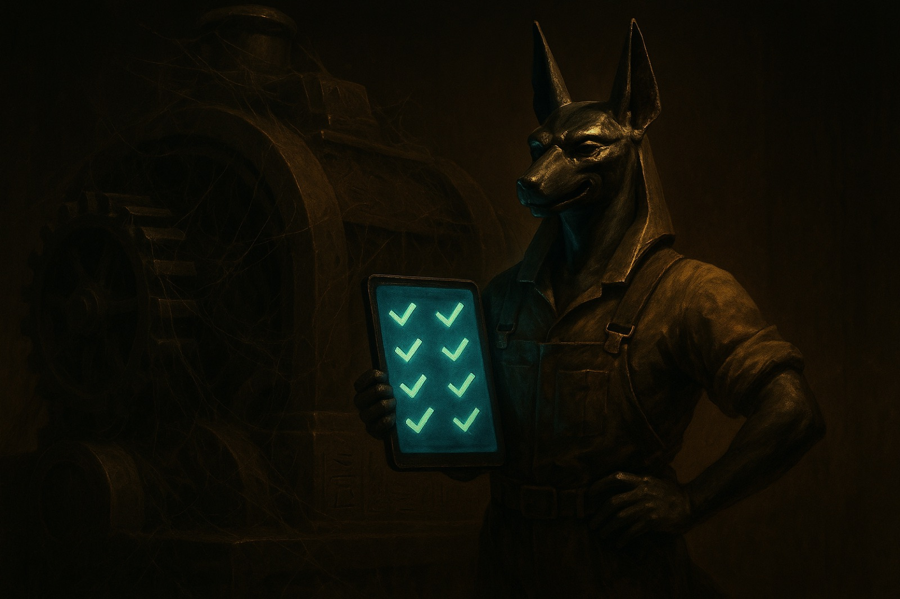
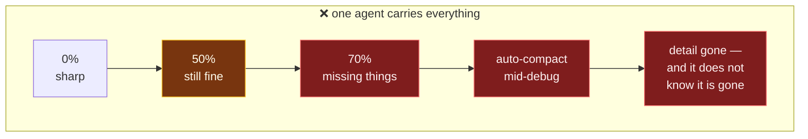
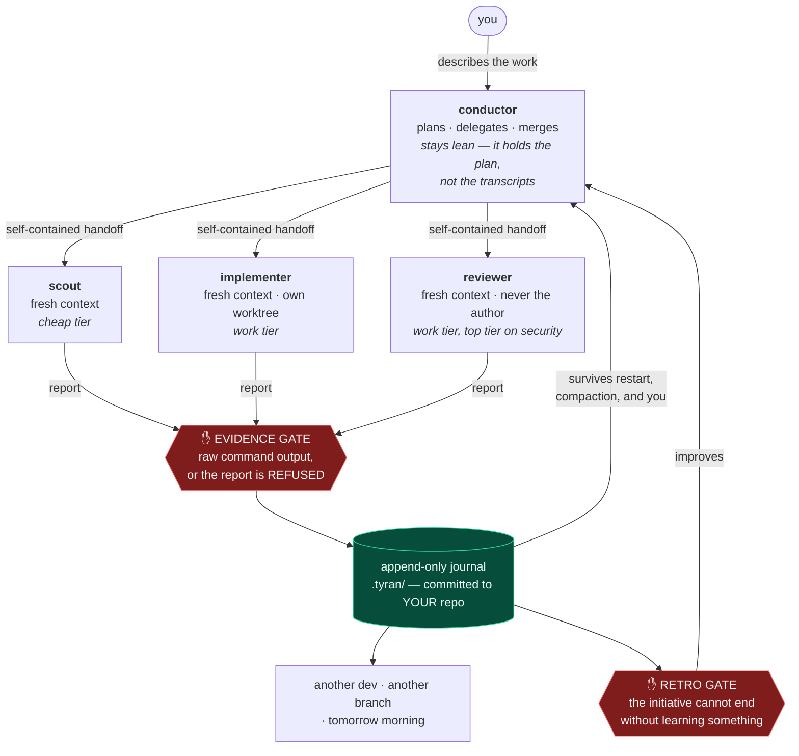
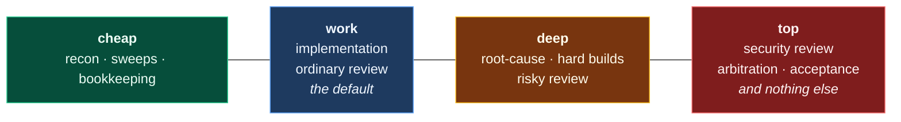

<p align="center">
  
</p>

<p align="center">
  <a href="https://github.com/jjanczur/tyran/actions/workflows/ci.yml"></a>
  <a href="https://github.com/jjanczur/tyran/actions/workflows/security.yml"></a>
  
  
  <a href="./LICENSE"></a>
  <a href="https://github.com/jjanczur/tyran/releases/latest"></a>
</p>

<p align="center">
  <b><a href="https://jjanczur.github.io/tyran/">📖 Documentation</a></b> ·
  <a href="https://jjanczur.github.io/tyran/getting-started/">Getting started</a> ·
  <a href="https://jjanczur.github.io/tyran/architecture/">Architecture</a> ·
  <a href="https://github.com/jjanczur/tyran/releases/latest">Releases</a>
</p>

<h3 align="center">The more you use it, the better it gets.</h3>

<p align="center">
Tyran is a task conductor for Claude Code: it interviews you, plans, and drives a team of
fresh-context agents through your work — <b>refusing to believe any agent that can't show
raw command output as proof</b>, routing every subtask to the cheapest model that can do
it, and keeping each agent in the context band where it still thinks clearly. When the
work is done, it will not let the initiative end until it has learned something from it.
</p>

---

## The Problem

Four failures, all of them ordinary, all of them silent. You will recognise
every one.

<p align="center">
  
</p>

| | What happens | What it costs you |
|---|---|---|
| 🟥 **Fake green** | *"Done — all tests pass."* Nothing was run. | You find out at review, or at deploy. The report was cheaper to write than the work. |
| 🟥 **Wrong model, wrong job** | The strongest, most expensive model renames a file, changes a button colour, runs a mechanical sweep. | You pay top rate for work any cheap tier does identically. Nobody notices, because it *worked*. |
| 🟥 **Context collapse** | Nobody compacts on purpose. The window fills to 60, 70%. Auto-compact then fires **in the middle of a hard debugging run**. | The fine detail the model had just discovered — the thing that took an hour — is gone, and it does not know it is gone. |
| 🟥 **Amnesia** | State lives in a chat window. Another dev, another branch, tomorrow morning — none of them can see where this got to. | The work is re-derived, or worse, half re-derived. |

**Context collapse is the expensive one**, and it is worth being precise about
why. Above roughly half the window, the model is carrying so much that it
starts missing things it would have caught at 10%. And the compaction that
should relieve that pressure is the very thing that destroys the detail:



## The Solution

**Split the work so nobody has to carry all of it**, and put the state in a
file instead of a window:



<p align="center">
  
</p>

Each of the four failures gets a mechanism, not a paragraph of advice:

| Failure | Mechanism | State |
|---|---|---|
| Fake green | A `SubagentStop` hook **rejects** a report with no raw command output. Measured on 55 real reports: 53 pass, and both misses were not reports. | ✅ shipped |
| Wrong model | Every role resolves to a tier from **one config file**. `top` — the expensive one — is reserved for security review, arbitration and acceptance, and a floor stops any profile or flag pushing those down. Effort is a **separate dial**: *same model, think harder* costs nothing extra. | ✅ shipped |
| Context collapse | Work goes to **fresh-context subagents** with self-contained handoffs, so the conductor never accumulates their transcripts. A `PreCompact` hook checkpoints before every compaction and **refuses a manual `/compact` it could not checkpoint**; `SessionStart` re-injects that checkpoint afterwards. | ✅ shipped · 🎯 a trigger that says *"compact now, this section is finished"* is **not built** |
| Amnesia | The journal is an append-only file **in your repo**, not in a window. `STATE.md` and `PROGRESS.md` are generated from it. Another agent, another dev, another branch reads where this got to — including which agent is still running and which lease nobody released. | ✅ shipped |

**Cheap where it doesn't matter, expensive where it does.** That is the whole
cost argument, and it is why the routing table is a table and not a vibe:



### And then it gets better on its own

<p align="center">
  
</p>

An initiative that ends without a retrospective is **refused one turn** by a
`Stop` hook. The retro reads the ledger, the notes and the agents' own
reports, and changes Tyran itself — through a filter whose default answer is
*change nothing*, which prefers **deleting a rule to adding one**, and which
is explicitly told not to breed agents, because a roster nobody can hold in
their head is its own cognitive tax.

```text
Initiative 1   Infers your stack, your validation commands, your deployment
               style from how the repo is actually worked. Asks once, about
               what it genuinely could not establish.
Initiative 5   Knows your shared-file hot zones, your flaky tests, your
               review taste. Its retro has already DELETED two of its own
               rules that weren't earning their keep.
Initiative 20  Has written repo-specific skills for your recurring work and
               merged two agents that overlapped. You mostly approve gates.
```

> **Status — what is shipped, and what is not.** Built epic by epic, in public.
> **Shipped and tested:** the plugin skeleton and CI; the `.tyran/` state
> layer (append-only journal, schema, generated projections, doctor); the
> enforcement hooks — evidence gate, secrets gate, policy gate, write guard,
> state re-injection, and a doctor check that catches a gate which cannot
> fire; the **conductor with its four-agent roster**, config-driven
> role-to-model-and-effort routing, and the `/tyran:setup`, `/tyran:status`,
> `/tyran:doctor`, `/tyran:retro` commands; and a `Stop` gate that makes the
> retrospective fire on its own rather than on someone remembering.
> **Not built yet:** the update delta-review, cost-profile benchmark
> receipts, and overnight mode. Every capability ships with tests before it
> is claimed, and the roadmap below says which is which.

## Quick Start

```text
/plugin marketplace add jjanczur/tyran
/plugin install tyran@tyran
/tyran:setup          # scans the repo, writes .tyran/config.yaml, installs /tyran
/tyran                # then just describe what you want done
```

Setup infers your stack, your validation commands and your deployment
autonomy class from how the repo is actually worked, annotates every value
with the fact that produced it, and asks you only about what it genuinely
could not establish. It also installs the bare `/tyran` shortcut — plugin
skills are namespaced, so the conductor is `/tyran:run`, and most people
would rather type four letters.

Then `/tyran` interviews you, sizes the work, and either does it itself
(small changes) or drives the roster — `tyran:scout`, `tyran:implementer`,
`tyran:reviewer`, `tyran:retro` — through it. Also: `/tyran:status`,
`/tyran:doctor`, `/tyran:retro`.

### It is not only an orchestrator — it ships skills you can use yourself

Eight skills and four agents come with the plugin. Six of the skills are the
conductor's own machinery, but they are **commands, not internals**: you run
`/tyran:doctor` on a repo you are debugging without ever starting an
initiative. Two are standalone protocols with nothing to do with
orchestration at all.

| Skill | What it does |
|---|---|
| [`run`](skills/run/SKILL.md) | the conductor — interviews, sizes, plans, delegates, merges |
| [`setup`](skills/setup/SKILL.md) | reads the repo and writes `.tyran/config.yaml`, provenance per value |
| [`status`](skills/status/SKILL.md) | where an initiative got to, from the journal rather than from memory |
| [`doctor`](skills/doctor/SKILL.md) | is any gate installed but unable to fire; is the state self-consistent |
| [`retro`](skills/retro/SKILL.md) | the anti-bloat curator that changes Tyran, never your product code |
| [`fidelity-gate`](skills/fidelity-gate/SKILL.md) | **standalone.** Build 1:1 against a frozen mockup without drift, measured rather than eyeballed |
| [`prompt-tuning`](skills/prompt-tuning/SKILL.md) | **standalone.** Tune anything whose quality is a non-deterministic model output — noise baseline first, then medians |
| [`hello`](skills/hello/SKILL.md) | proves the plugin is installed and its paths resolve |

Agents: `tyran:scout` (recon, read-only), `tyran:implementer` (one story,
own branch), `tyran:reviewer` (**no editing tools** — it cannot patch what it
is grading), `tyran:retro`. Roles, assumptions and who invokes each are in
[the roster](docs/agents.md).

The two standalone protocols exist because the rule alone was not enough —
`fidelity-gate` had been inlined into three sentences and lost the inventory
step that does the work; `prompt-tuning` kept its principle and lost
everything the principle was distilled from.

Hit the brake at any time, from anywhere, without killing the session:

```bash
echo "wrong branch — hold everything" > .tyran/STOP
```

## What makes Tyran different

- 🧾 **Proof-or-it-didn't-happen.** Agent reports without raw command output
  (exit codes, `X passed / Y failed`) are rejected *mechanically* at the
  `SubagentStop` hook — not by asking nicely in a prompt. **This gate blocks
  SILENCE, not FORGERY:** an agent that invents the text `232 passed / 0
  failed` walks straight through it. The gate raises the price of a lie — it
  has to be deliberately fabricated rather than simply waved away — and it does
  not remove it. Nor is the criterion "raw command output" — mechanically it is
  *"a digit next to one of seven test-runner keywords"*, so a build log without
  an exit code is refused and a sentence containing `6 / 6 passed` is not.
  Measured on 55 real reports from this project's own agents: 53 pass, and both
  misses turned out not to be reports at all. Details, numbers in both
  directions, and limits in [the evidence gate](docs/evidence-gate.md).
- 🔁 **It learns *your* workflow — and the loop closes itself.** When an
  initiative's tickets are all merged with no retrospective recorded since
  the last merge, a `Stop` hook refuses **one** turn and names what is owed.
  `tyran:retro` then distills your repo's rules into `.tyran/knowledge/` and
  tunes Tyran's own playbook, through an anti-bloat filter with four
  questions, a hard cap of three edits per retrospective, and a stated
  preference for deleting rules over adding them — so *"I changed nothing"*
  is a correct outcome, and so is declining the retro entirely. **You are
  never blocked twice**, whichever you choose. This is a gate rather than a
  sentence in a skill because the retro is the step most easily skipped: it
  happens after the merge, when the interesting part is over.
- 🔁 **Survives restarts and compaction.** Execution state lives in an
  append-only journal in your repo; a session hook re-injects it after every
  compaction or resume. The team forgets nothing.
- 🎯 **Update-safe evolution.** *(designed, not built.)* Three layers:
  immutable core plugin · your repo's data (`.tyran/`) · locally evolved
  skills. The layout is real — `.tyran/` exists and is never written by the
  plugin's own files — but the delta-review agent that reconciles a new core
  version with what your repo has learned does not exist yet.
- 💰 **Cost modes that resolve from config, not from habit.** Model names
  appear in exactly ONE file. Everything else — skills, agents, policies — is
  written in role names, so a model deprecation is a one-line edit instead of
  a sweep through every prompt. `node scripts/tiers.mjs --role reviewer`
  answers with an alias; `--risk high` escalates one tier. The default puts
  everyday work on the mid tier and reserves the expensive ones for calls
  where being wrong is both costly and hard to notice — and **security review
  and arbitration have a floor no profile or risk flag can push them below**,
  because otherwise `eco` would quietly become a one-flag downgrade of the two
  judgements everything downstream trusts. A missing alias throws rather than
  falling back to the session default: routing that silently does nothing
  looks exactly like routing that works.
- 🔒 **Autonomy with a gate on the irreversible step.** Every commit and push
  is scanned for secrets before it happens — the gate assembles the payload
  itself and verifies the scanner covered all of it, so a `.gitattributes`
  line cannot hide anything from it. `--no-verify` (and its abbreviations) and
  force-pushes are refused; a push to your production branch is refused at the
  strictest autonomy class, including through `HEAD`, `@`, a shell variable or
  a `git -c` alias. **What it does not do is stop an agent from raising the
  class itself:** the config file holding it is GATED, not KERNEL, so an agent
  with a broad allow-list can edit it in the main loop — measured, not
  supposed. Autonomy classes are a convention the gate enforces downward, not
  a lock. Not a firewall, and
  [docs/hooks.md](docs/hooks.md) says exactly where it stops — including the
  scanner's own measured false-negative rate.

## How it compares

Verified against competitors' **code and public issue trackers** (July 2026),
not their READMEs. ✅ shipped/enforced · ⚠️ partial or prompt-only · ❌ absent
or broken · — not applicable · 🎯 **committed in the v2 design, ships
test-gated** (flips to ✅ only when the tests exist and pass).

| Capability | **Tyran v2** | oh-my-claudecode | metaswarm | pilotfish | pro-workflow |
|---|:---:|:---:|:---:|:---:|:---:|
| Evidence contract that **blocks**: no raw command output → report rejected | ✅ | ⚠️ advisory¹ | ⚠️ prompt | ⚠️ prompt | ❌ |
| Learns **your repo's** rules, with an anti-bloat curator + decision ledger | ✅⁹ | ⚠️ | ⚠️ | ❌ by design | ⚠️ regex-based |
| Execution state survives restart & compaction (journal + re-inject) | ✅ | ⚠️ | ❌² | ❌ | ⚠️ |
| Plugin update **never** destroys local learning (3 layers + delta agent) | 🎯 | ❌³ | — | — | ⚠️ |
| Cost modes resolved from repo config (`eco`/`balanced`/`full`, role-based routing, model names in ONE file) | ✅ | ⚠️ docs-only | ❌ | ⚠️ global-only | ❌ |
| Secret gate on commit/push with verified scan coverage, no `--no-verify` escape | ✅ | ❌ | ❌ | ❌ | ⚠️ |
| Independent reviewer that never grades its own homework | ✅⁷ | ⚠️ | ⚠️ prompt | ⚠️ | ❌ |
| Small curated core — no context tax, enforced in CI | ✅ | ❌⁴ | ⚠️ | ✅ | ❌ |
| Safe parallelism: worktree per agent, leases, sequential merge | ✅⁸ | ⚠️ | ❌ | — | ❌⁵ |
| Clean install: 2 commands, **never writes into your `~/.claude`** | ✅ | ❌³ | ⚠️ | ❌ | ⚠️ |
| OSS hygiene: license, changelog, CI validation, pressure tests | ✅ | ⚠️ | ⚠️ | ✅ | ❌⁶ |
| Skills · agents it ships, counted from the repo tree | 8 · 4¹⁰ | 41 · 19 | 14 · 19 | 0 · 8 | 41 · 8 |

<sub>¹ Their deliverable check is explicitly non-blocking ("never prevents the
agent from stopping"). ² Their issues #32/#33/#36: crash loses loop state.
³ Open issues #3535/#3536: update deletes user files from `~/.claude`.
⁴ Their issue #2943: "50+ skills exceeding context description budget."
⁵ Their issues #73/#74: worktree hook broke isolated spawns. ⁶ "MIT" badge
links to a LICENSE file that does not exist in the repo; the GitHub API
reports no license for it. ⁷ The reviewer agent is granted no editing tools,
so it cannot patch what it is grading — but it keeps `Bash` in order to run
the tests, and `Bash` can write. This raises the price of self-approval; it
does not make it impossible. ⁸ Worktrees, leases and sequential merge are
specified in the conductor skill, and lease events are recorded in the
journal, so `STATE.md` surfaces a lease released by a non-holder. Detection,
not prevention: nothing physically stops a second agent from entering a held
worktree. ⁹ The retrospective is triggered by a `Stop` gate and the curator's
filter is enforced in the agent's own contract, but what it decides to record
is a judgement, not a mechanism — and the gate deliberately accepts "I am
skipping this" as a complete answer. ¹⁰ <b>The one row where a bigger number
is not a better one, printed anyway.</b> Measured on each repo's default
branch, July 2026: files matching <code>skills/*/SKILL.md</code> and
<code>agents/*.md</code>. Two competitors ship five times as many skills as
Tyran does, and that is the point of the "small curated core" row above —
oh-my-claudecode's own issue #2943 is titled "50+ skills exceeding context
description budget", which is the bill that arrives with the larger number.
Tyran's eight are held under a description budget CI enforces on every push
(2407 of 4000 characters). Counting files is not counting value: what each
skill is for is in <a href="skills/">skills/</a>, one directory each.</sub>

## Command-line use (outside Claude Code)

A single `bin/tyran.mjs` entry point exposes the same scripts the plugin's
hooks and skills already call — `doctor`, `scan-repo`, `tiers`, `journal`,
`schema`, `stop-check`, `scan-control-chars`, `desc-budget` — for a shell or a
CI job with no Claude Code session. Zero dependencies; `--help` lists them.

```bash
node bin/tyran.mjs doctor --hooks     # is any gate installed but unable to fire?
node bin/tyran.mjs scan-repo --dir .  # what this repo looks like, with provenance
```

Exit codes propagate to the digit, so a CI step reddens exactly when the
underlying script does.

> **Not on npm yet — so `npx tyran` does not work today.** The package is
> built, versioned and tested; only the publish is outstanding. Saying `npx
> tyran` here before that is true would be exactly the kind of claim this
> project refuses to accept from its own agents.
>
> **And it would not install the Claude Code plugin either.** For that, run
> `/plugin marketplace add jjanczur/tyran` inside Claude Code. The npm package
> is the tooling; the plugin is the conductor.

## Documentation

**Everything below also reads as a site: [jjanczur.github.io/tyran](https://jjanczur.github.io/tyran/)**
— same text, with search, rendered diagrams and per-page status badges.

- 📖 [Getting started](docs/getting-started.md)
- ⚙️ [Configuration](docs/configuration.md) — `.tyran/config.yaml`, cost profiles, autonomy classes
- 🎭 [The roster and model routing](docs/agents.md) — the four agents, the tier and effort table, dynamic overrides, the `.tyran/STOP` brake (shipped)
- 🏛️ [Architecture](docs/architecture.md) — the three layers, the journal, the hooks
- 📜 [Journal reference](docs/journal.md) — the append-only event schema (shipped)
- 🧾 [Projections](docs/projections.md) — generated `STATE.md` / `PROGRESS.md` and `--check` (shipped)
- 🩺 [Doctor](docs/doctor.md) — `--state` consistency check: drift, orphan leases, dead policy rules (shipped)
- 🪝 [Hook runtime](docs/hooks.md) — gates vs probes, why hooks fail open, and what the deadline really promises (shipped)
- 🧾 [Evidence gate](docs/evidence-gate.md) — the criterion, who it binds, the recorded escape hatch, and the line between silence and forgery (shipped)
- 🛡️ [Policy gate](docs/policy-gate.md) — path classes, the deployment class, the one rule on reads, and where each stops (shipped)
- 🧠 [Self-improvement](docs/self-improvement.md) — how Tyran learns your repo, and its guardrails
- ❓ [FAQ](docs/faq.md)
- 🤝 [Contributing](CONTRIBUTING.md)

## Strategic principles

1. **Native mechanisms only.** Built entirely on Claude Code's plugin surface:
   agent frontmatter, hooks, skills-dir plugins. No custom runtime. When the
   platform absorbs a capability, Tyran drops a layer instead of competing
   with the vendor.
2. **Enforcement over prompts.** A rule that matters becomes a hook or a
   script. Prose is for judgment; mechanisms are for discipline.
3. **Evidence over claims.** From agent reports to this README's comparison
   table: nothing is asserted without receipts.
4. **The repo is the memory.** All state and learned rules live in *your*
   repository as reviewable text files. No hidden databases, no build step,
   no silent degradation.
5. **Local evolution, curated upstream.** Tyran adapts to each repo locally;
   generalizable improvements travel to the core as pull requests.
6. **Autonomy earns trust in layers.** Detected once, confirmed with you, and
   enforced downward by the policy gate. Not *"never self-escalated"* — the
   file holding the class is GATED rather than KERNEL, and an agent with a
   broad allow-list can edit it. Measured, not assumed; see
   [the policy gate](docs/policy-gate.md).

## Roadmap

- [x] Plugin skeleton, marketplace, CI (validate ×2, tests, description
      budget, gitleaks, semgrep)
- [x] `.tyran/` state layer: append-only journal, knowledge schema, generated
      human-readable projections, `doctor --state`
- [x] Enforcement hooks: evidence gate, secrets gate, policy gate, write
      guard, state re-inject, and `doctor --hooks` — which catches a gate
      that is installed but cannot fire
- [x] `/tyran:run` conductor + the four-agent roster + role-to-model routing
      resolved from `.tyran/config.yaml`, plus the `.tyran/STOP` brake
- [x] `/tyran:setup` repo scanner (never infers `P3`) + `/tyran:doctor`,
      `/tyran:status`, `/tyran:retro`, and the bare `/tyran` shortcut
- [x] Self-improvement loop: a `Stop` gate that will not let an initiative
      end unretrospected, plus knowledge accumulation into `.tyran/knowledge/`
- [ ] Cost-profile benchmark receipts (three runs per profile on a fixture,
      published as numbers rather than as a table of intentions)
- [ ] Update delta-review: reconcile a new core version with what your repo
      has learned locally
- [ ] Overnight mode (ralph-tui integration)
- [ ] Read-only dashboard (phase C)

## Where this came from

Tyran started as a teaching problem. One of us was mentoring the other
through learning to program, and the mentee kept hitting the same wall — not
with the code, with the *tool*. Claude would ask a pile of hard questions at
once, lose the thread halfway through the answer, and burn a small fortune in
tokens re-deriving what it had already worked out. From the outside it looked
like a skill problem. It was a **context** problem.

So we sat down and went through how Claude Code actually works underneath —
agent teams, subagents, why a fresh context beats a long one, why the state
has to live somewhere the window cannot take with it. That conversation
turned into a plugin. The first version was **pure prompt**: a long, careful
skill that told the model how to behave. It worked exactly as well as a
written rule ever works — until the run got long, or expensive, or boring.

That failure is the whole reason for v2. Every rule that mattered got
demoted from a paragraph to a **mechanism**: a hook that refuses a report
with no command output, a gate that will not let an initiative close
unretrospected, a file that decides which model a role gets. The motto on the
conductor skill — *a rule in prose loses to a mechanism that makes the mistake
impossible* — is not a slogan we adopted. It is the lesson v1 taught us, in
the order we learned it.

## License

[Apache-2.0](./LICENSE)

---

<p align="center">
From Berlin with <b>&hearts;</b> by two buddies &mdash;
<a href="https://janczura.com">Jacek</a> and Piotr.
</p>
