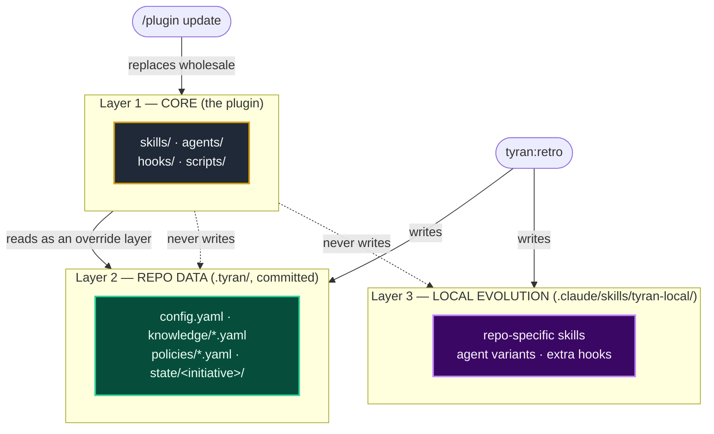
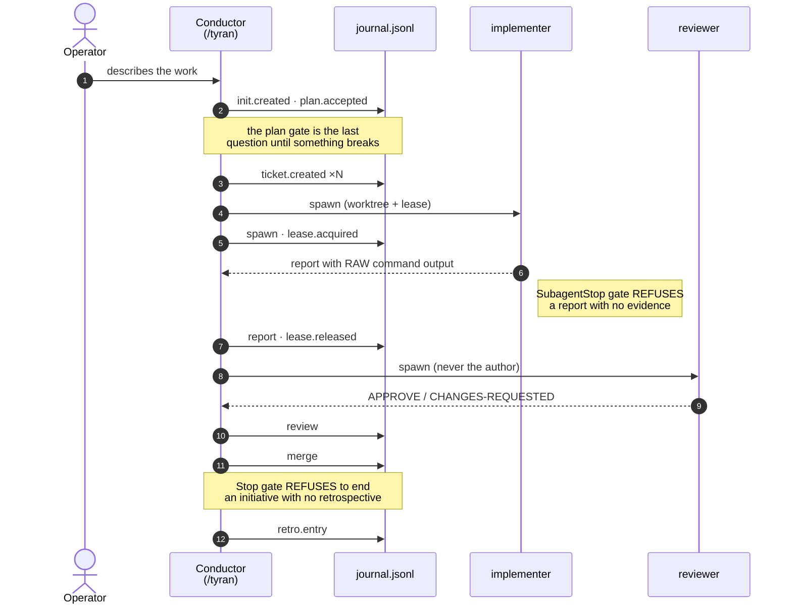
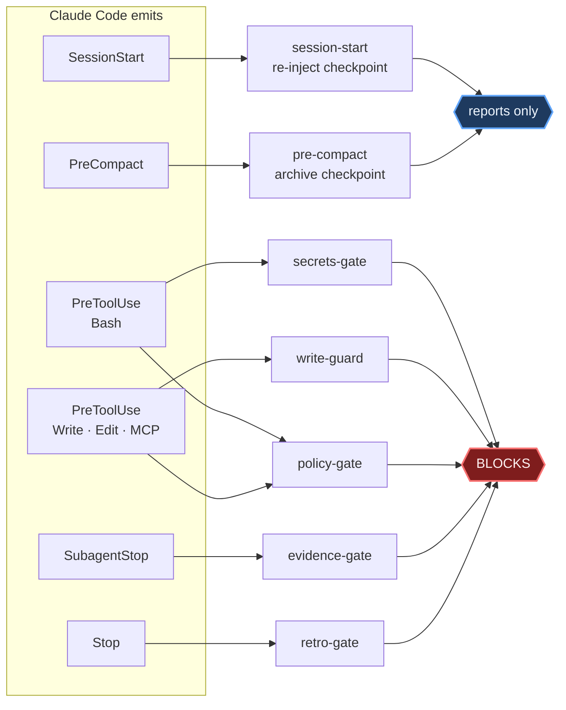

# Architecture

✅ **shipped** · the state layer, the enforcement hooks, the conductor and the
agent roster, all with tests behind them

This is the design contract for v2. Everything in the tables below exists in
code unless the row says otherwise: a row that is still design carries an
explicit marker, and there is no unmarked aspiration on this page. The
[roadmap](../README.md#roadmap) is where the outstanding work is tracked.

## The three layers

```text
Layer 1 — CORE (this repo, installed as a plugin; immutable locally)
  skills/ · agents/ · hooks/ · scripts/ · tests/
  Updated via /plugin update. Never edited in your repo.

Layer 2 — REPO DATA (.tyran/ in YOUR repo; committed)
  config.yaml · knowledge/*.yaml · policies/*.yaml · state/<initiative>/
  Pure data. The core loads it as an override layer. This is where Tyran's
  learning about YOUR repo lives — and why updates can't destroy it.

Layer 3 — LOCAL EVOLUTION (.claude/skills/tyran-local/ in YOUR repo)
  A companion skills-dir plugin maintained by the retro agent: repo-specific
  skills, agent variants, extra hooks. Physically separate from both the
  core and the data layer. Loaded natively by Claude Code.
```



**Read the dotted arrows first.** The core never writes into layers 2 and 3,
which is the entire reason a plugin update cannot destroy what your repo has
learned: the update replaces layer 1 wholesale, and layer 1 owns nothing your
repo produced.

After a core update, a delta-review agent compares the new version's
changelog against layers 2–3 and proposes reconciliation (e.g. "the core
absorbed a rule your repo learned locally — delete the local duplicate").
🎯 **Designed, not built** — the layout is real and the layers are separate
today; the reconciling agent does not exist yet.

## State: the journal

The source of truth for every initiative is an **append-only JSONL journal**
(`.tyran/state/<initiative>/journal.jsonl`). One line = one event, from a
closed, validated set: `init.created`, `plan.accepted`, `ticket.created`,
`spawn`, `report` (with raw evidence), `gate`, `review`, `merge`, `decision`,
`lease.acquired/released`, `checkpoint`, `retro.entry`, `error`.

Humans never read JSONL: `STATE.md` and `PROGRESS.md` are **generated
projections** with a `GENERATED — do not edit` header (see
[projections.md](./projections.md)). Append-only means a
crash mid-write can at worst produce one truncated final line, which the
reader discards. No database, no build step, git-friendly diffs.

An initiative, end to end — every arrow below is an event in that journal:



## Enforcement: the hooks

| Event | What Tyran does | Blocking |
|---|---|---|
| `SessionStart` (startup/resume/**compact**) | re-injects the initiative checkpoint into context | no |
| `SubagentStop` | evidence gate: implementer/reviewer reports must contain raw command output — otherwise the report is rejected with a reason | **yes** |
| `PreToolUse` (Bash) | secrets gate: staged diff through gitleaks before commit/push; `--no-verify`, bare force-push blocked | **yes** |
| `PreToolUse` (Write/Edit/Bash) | policy gate: autonomy classes (P1/P2/P3) and self-improvement path classes (AUTO/GATED/KERNEL) | **yes** |
| `Stop` | retro gate: an initiative whose tickets are all merged and which has no retrospective recorded since the last merge refuses ONE turn | **yes** |
| `PreCompact` | writes a checkpoint before compaction — and refuses a **manual** `/compact` it could not write. An **automatic** compaction is never refused, because refusing one would end the session | **manual only** |
| `TaskCompleted` | **🎯 DESIGNED, NOT REGISTERED.** The runtime in `hook-io.mjs` knows the event and would let a gate block on it, but `hooks.json` registers nothing there, so nothing runs. Listed here because the type scaffolding exists and misreads as shipped otherwise. | — |



Design rule: **critical gates fail loudly.** If a gate itself breaks, it
denies with an explanation — it never silently allows.

The exception, stated because it is the one that matters: hooks **fail open**
at the platform level. A gate whose file is missing or whose matcher can
never match does not become a weaker check — the action simply proceeds, with
nothing printed anywhere. That is why `tyran doctor --hooks` exists, and why
a dead gate and a healthy gate are indistinguishable from inside a session
without it.

## Agents

| Agent | Constraints (frontmatter, enforced by the platform) |
|---|---|
| `tyran-scout` | read-only tool allowlist; cannot spawn agents |
| `tyran-implementer` | `isolation: worktree`; turn limit; cannot spawn agents |
| `tyran-reviewer` | never reviews its own code; verdict CONFIRMED/REFUTED — a verifier that fixes work stops being independent |
| `tyran-retro` | writes only to AUTO-classified paths |

## Why no custom runtime?

Everything above uses Claude Code's native surfaces: plugin manifests, agent
frontmatter (`model`, `effort`, `maxTurns`, `tools`, `isolation`), hooks, and
skills-dir plugins. That's deliberate: when the platform absorbs a
capability, Tyran drops a layer instead of competing with the vendor — and
nothing here requires trusting our code with more than your repo.
