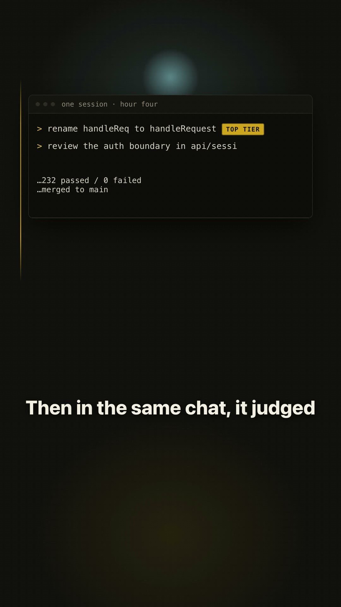
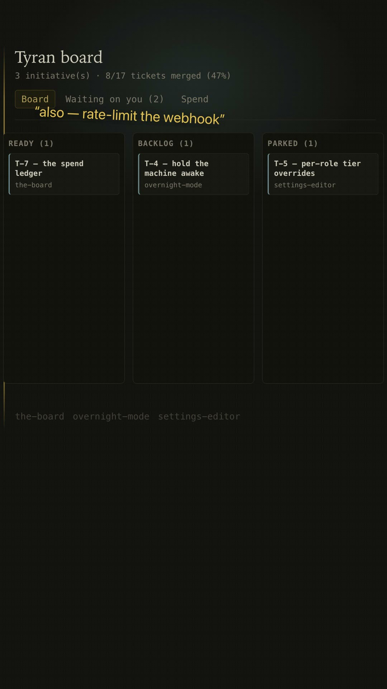
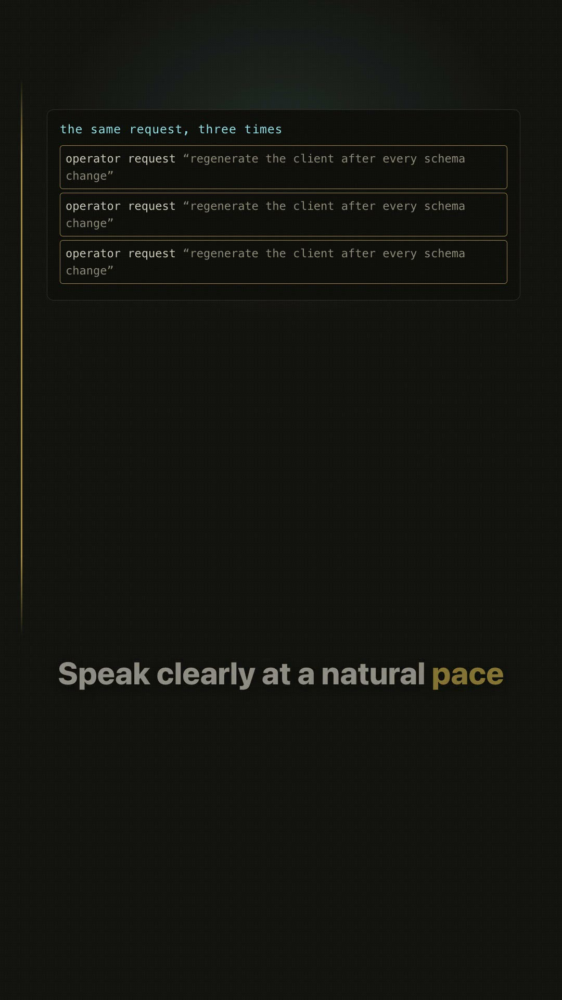

# Videos

Five cuts. They are not five lengths of the same video — each one answers a
different question, and the one you want depends on what you do not yet
believe.

| video | length | answers |
|---|---|---|
| [The explainer](https://youtu.be/ThulYtbYNXI) | 3:20 | What is this and why would I run it? |
| [Your first session](https://youtu.be/vr49hKk9G8g) | 3:53 | I'm sold — what do I actually type? |
| [One chat, one model](https://www.youtube.com/shorts/2EgRBR0fVRo) | 1:01 | Why is my bill high and my output worse? |
| [The board](https://www.youtube.com/shorts/HKePDLkYDqA) | 0:59 | What does delegation look like from outside? |
| [It learns you](https://www.youtube.com/shorts/EMcPJj7c0mk) | 1:22 | What does it do that a prompt pack cannot? |

Everything on screen is real: the board is a published journal, the spend is
the actual rollup, and the run being narrated is Tyran building Tyran. The
board in all of them is the one you can [click
yourself](https://jjanczur.github.io/tyran/sandbox/) — no install.

---

## The explainer

**3:20 · 16:9 · the one to watch first.**

Opens on the sentence most people recognise from their own last session:
*your most expensive model just renamed a variable, and in the same chat it
judged an authentication boundary.* From there it turns the manager on and
pays every claim off on the live board — routing, the tier floor, a spoken
aside hardening into ticket T-9, the bill broken out by role, the hooks that
refuse, and the retrospective the team runs on itself.

**How it differs:** it is the only cut that carries the whole argument end to
end. Every other video is one of its beats, expanded.

**Use it for:** the top of the README, the site, a conference Slack, a
LinkedIn post, the first link you send to someone who has never heard of
Tyran. If you have one slot, this is it.

## Your first session

**3:53 · 16:9 · the tutorial.**

Install, `/tyran:setup` on a real repository, brief the manager, watch the team
go out, read the board, answer a question from the board, and see what the
retro changed. Eight chapters. Every command appears exactly as it is typed.

**How it differs:** the explainer argues; this one instructs. It assumes you
have already decided to try it and wants you productive today. It is the only
cut with commands you are meant to copy.

**Use it for:** the [getting started](getting-started.md) page, onboarding a
teammate, and the "how do I actually run this" reply. It is deliberately not
the first thing a stranger sees — it answers a question they have not asked
yet.

## One chat, one model, every job

**1:01 · 9:16 · the diagnosis.**

The mistake, named and fixed in sixty seconds. No good team puts a principal
engineer on a grep — but that is what one chat and one model does to every
task you hand it. Ends on the scout's three-cent reconnaissance as the proof.

**How it differs:** the only cut aimed at someone who does not yet know they
have a problem. It leads with the symptom — a high bill and worse work — and
never explains the architecture.

**Use it for:** Shorts, TikTok, X. The cold-audience opener.

## The board

**0:59 · 9:16 · the flashy one.**

Opens on a Kanban board that is already moving and never leaves it. Ten lanes,
a blocker that says how long it has stood still, an aside that becomes ticket
T-9 with a journal receipt, a card an agent crosses into DONE by itself, and a
real question answered on the page.

**How it differs:** it shows rather than argues. No metaphor, no install
instructions — just the artefact, moving. It is the most immediately legible
of the five and the easiest to share without context.

**Use it for:** the most shareable Short. Also the right link when someone
asks "so what do you actually get?" — pair it with the
[sandbox](https://jjanczur.github.io/tyran/sandbox/) so they can click it
themselves.

## It learns you

**1:22 · 9:16 · the differentiator.**

The Stop gate refusing one turn, the retro reading the record, a shallow
question edited out of the conductor's own instructions, three repeated
requests hardening into a skill, and a knowledge entry retired on its own
counters. The knowledge panel opens at five entries, drops to four, climbs
back to five, and lands exactly where it began.

**How it differs:** the only cut about the pillar competitors do not have, and
the only one whose point is *restraint* — most retros correctly change
nothing. It is the least flashy and the most convincing to a sceptic.

**Use it for:** the [self-improvement](self-improvement.md) page, and the reply
to "isn't this just a prompt pack?"

---

## Where they come from

Sources live in `video/` — Hyperframes compositions, the voiceover pipeline,
the scripts and the storyboards, all tracked. The renders are not: they run to
roughly 430 MB, and this repository is what `/plugin marketplace add` clones,
so committing them would put marketing video into every install of the plugin.
`video/README.md` documents how to rebuild any cut from source.
