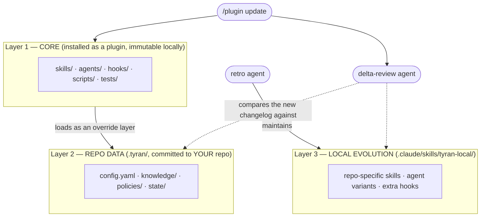

import { Aside, Code } from '@astrojs/starlight/components';
import Provenance from '../../components/Provenance.astro';
import Verdict from '../../components/Verdict.astro';

export const THREE_LAYERS = `Layer 1 — CORE (this repo, installed as a plugin; immutable locally)
  skills/ · agents/ · hooks/ · scripts/ · tests/
  Updated via /plugin update. Never edited in your repo.

Layer 2 — REPO DATA (.tyran/ in YOUR repo; committed)
  config.yaml · knowledge/*.yaml · policies/*.yaml · state/<initiative>/
  Pure data. The core loads it as an override layer. This is where Tyran's
  learning about YOUR repo lives — and why updates can't destroy it.

Layer 3 — LOCAL EVOLUTION (.claude/skills/tyran-local/ in YOUR repo)
  A companion skills-dir plugin maintained by the retro agent: repo-specific
  skills, agent variants, extra hooks. Physically separate from both the
  core and the data layer. Loaded natively by Claude Code.`;

<Provenance>
the state layer, the enforcement hooks, the conductor and the agent roster, all with
tests behind them
</Provenance>

This is the design contract for v2. Everything in the tables below exists in
code unless the row says otherwise: a row that is still design carries an
explicit marker, and there is no unmarked aspiration on this page. The
[roadmap](#roadmap) at the foot of this page tracks the outstanding work.

## The four failures this is guarding against

Every mechanism on this page answers one of four ordinary, silent failures.

| Failure | What happens | Where it is answered |
|---|---|---|
| **Fake green** | *"Done — all tests pass."* Nothing was run. You find out at review, or at deploy: the report was cheaper to write than the work. | [the evidence gate](../evidence-gate/) |
| **Wrong model, wrong job** | The strongest, most expensive model renames a file, changes a button colour, runs a mechanical sweep. Nobody notices, because it *worked*. | [the roster](../agents/#choosing-models) |
| **Context collapse** | Nobody compacts on purpose. The window fills to 60, 70%. Auto-compact then fires in the middle of a hard debugging run, and the fine detail the model had just discovered is gone — and it does not know it is gone. | fresh-context subagents (below), plus `PreCompact` and `SessionStart` |
| **Amnesia** | State lives in a chat window. Another dev, another branch, tomorrow morning — none of them can see where this got to, so the work is re-derived, or worse, half re-derived. | the journal (below) |

Context collapse is the expensive one, and it is worth being precise about
why. Above roughly half the window the model is carrying so much that it
starts missing things it would have caught at 10% — and the compaction that
should relieve that pressure is the very thing that destroys the detail.

## The three layers

<Code code={THREE_LAYERS} lang="text" title="The three layers" />

After a core update, a delta-review agent compares the new version's
changelog against layers 2–3 and proposes reconciliation (e.g. "the core
absorbed a rule your repo learned locally — delete the local duplicate").
<Verdict state="designed" /> **Designed, not built** — the layout is real and
the layers are separate today; the reconciling agent does not exist yet.

## State: the journal

The source of truth for every initiative is an **append-only JSONL journal**
(`.tyran/state/<initiative>/journal.jsonl`). One line = one event, from a
closed, validated set: `init.created`, `plan.accepted`, `ticket.created`,
`spawn`, `report` (with raw evidence), `gate`, `review`, `merge`, `decision`,
`lease.acquired/released`, `checkpoint`, `retro.entry`, `error`.

Humans never read JSONL: `STATE.md` and `PROGRESS.md` are **generated
projections** with a `GENERATED — do not edit` header (see
[projections.md](../projections/)). Append-only means a
crash mid-write can at worst produce one truncated final line, which the
reader discards. No database, no build step, git-friendly diffs.

## Enforcement: the hooks

| Event | What Tyran does | Blocking |
|---|---|---|
| `SessionStart` (startup/resume/**compact**) | re-injects the initiative checkpoint into context | no |
| `SubagentStop` | evidence gate: implementer/reviewer reports must contain raw command output — otherwise the report is rejected with a reason | **yes** |
| `PreToolUse` (Bash) | secrets gate: staged diff through gitleaks before commit/push; `--no-verify`, bare force-push blocked | **yes** |
| `PreToolUse` (Write/Edit/Bash) | policy gate: autonomy classes (P1/P2/P3) and self-improvement path classes (AUTO/GATED/KERNEL) | **yes** |
| `Stop` | retro gate: an initiative whose tickets are all merged and which has no retrospective recorded since the last merge refuses ONE turn | **yes** |
| `PreCompact` | writes a checkpoint before compaction — and refuses a **manual** `/compact` it could not write. An **automatic** compaction is never refused, because refusing one would end the session | **manual only** |
| `TaskCompleted` | <Verdict state="designed" /> **NOT REGISTERED.** The runtime knows the event and would let a gate block on it, but `hooks.json` registers nothing there, so nothing runs. Listed because the type scaffolding exists and reads as shipped otherwise | — |

<Aside type="danger" title="Design rule">
Design rule: **critical gates fail loudly.** If a gate itself breaks, it
denies with an explanation — it never silently allows.
</Aside>

## Agents

| Agent | Constraints (frontmatter, enforced by the platform) |
|---|---|
| `tyran-scout` | read-only tool allowlist; cannot spawn agents |
| `tyran-implementer` | `isolation: worktree`; turn limit; cannot spawn agents |
| `tyran-reviewer` | never reviews its own code; verdict CONFIRMED/REFUTED — a verifier that fixes work stops being independent |
| `tyran-retro` | writes only to AUTO-classified paths |

**The conductor holds the plan, not the transcripts.** Work goes to
fresh-context subagents with **self-contained handoffs**, so an agent's
reading, its dead ends and its output never accumulate in the context of the
session that delegated it. That is what makes context collapse a design
property rather than a discipline: the conductor cannot fill its window with
work it did not do.

## Strategic principles

1. **Native mechanisms only.** Built entirely on Claude Code's plugin surface:
   agent frontmatter, hooks, skills-dir plugins. No custom runtime. When the
   platform absorbs a capability, Tyran drops a layer instead of competing
   with the vendor.
2. **Enforcement over prompts.** A rule that matters becomes a hook or a
   script. Prose is for judgment; mechanisms are for discipline.
3. **Evidence over claims.** From agent reports to the comparison table in
   [the FAQ](../faq/): nothing is asserted without receipts.
4. **The repo is the memory.** All state and learned rules live in *your*
   repository as reviewable text files. No hidden databases, no build step,
   no silent degradation.
5. **Local evolution, curated upstream.** Tyran adapts to each repo locally;
   generalizable improvements travel to the core as pull requests.
6. **Autonomy earns trust in layers.** Detected once, confirmed with you, and
   enforced downward by the policy gate. Not *"never self-escalated"* — the
   file holding the class is `AUTO`, so an agent can edit it, chosen so that
   an agent can also repair the validation commands stored beside it.
   Measured, not assumed; see [the policy gate](../policy-gate/).

Principle 1 is why there is no custom runtime. Everything above uses Claude
Code's native surfaces: plugin manifests, agent frontmatter (`model`,
`effort`, `maxTurns`, `tools`, `isolation`), hooks, and skills-dir plugins —
and nothing here requires trusting our code with more than your repo.

## Roadmap

- [x] Plugin skeleton, marketplace, CI (validate ×2, tests, description
      budget, gitleaks, semgrep)
- [x] `.tyran/` state layer: append-only journal, knowledge schema, generated
      human-readable projections, `doctor --state`
- [x] Enforcement hooks: evidence gate, secrets gate, policy gate, write
      guard, state re-inject, and `doctor --hooks` — which catches a gate
      that is installed but cannot fire
- [x] `/tyran:run` conductor + the four-agent roster + role-to-model routing
      resolved from `.tyran/config.yaml`, plus the `.tyran/STOP` brake
- [x] `/tyran:setup` repo scanner (never infers `P3`) + `/tyran:doctor`,
      `/tyran:status`, `/tyran:retro`, and the bare `/tyran` shortcut
- [x] Self-improvement loop: a `Stop` gate that will not let an initiative
      end unretrospected, plus knowledge accumulation into `.tyran/knowledge/`
- [x] [Overnight mode](../overnight/): usage-limit pause + scheduled resume —
      the statusline telemetry sidecar, a wind-down gate near the subscription
      window, and a watcher that resumes (or, on a days-away weekly reset,
      notifies and holds)
- [x] Read-only dashboard: the kanban board — `BOARD.md`/`board.json` next to
      every journal, one cross-initiative [`board.html`](../board/) in the
      landing page's own palette, refreshed on every subagent stop, plus
      `board.mjs --serve`
- [x] [The spend ledger](../cost/): what the work actually cost, read out of
      the transcripts Claude Code already writes — tokens per model, per agent
      type and per ticket, money only under a rate card you write, and a Spend
      section the board fetches rather than embeds
- [x] The mistakes ledger: `MISTAKES.md` at your repo root — what went wrong
      here and how often — where three occurrences of one signature graduate a
      lesson into `.tyran/knowledge/` and five write a rule into your
      `CLAUDE.md`, inside Tyran's own fence — see
      [self-improvement](../self-improvement/)
- [ ] Cost-profile benchmark receipts (three runs per profile on a fixture,
      published as numbers rather than as a table of intentions)
- [ ] Update delta-review: reconcile a new core version with what your repo
      has learned locally

**Two things are not built yet:** the update delta-review and the
cost-profile benchmark receipts. Everything else here exists in code with
tests behind it — nothing is claimed before it ships.
