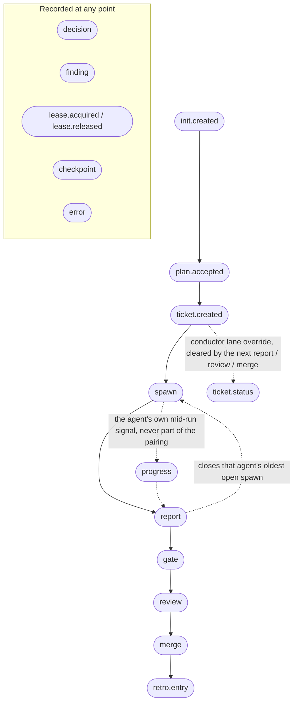

import { FileTree } from '@astrojs/starlight/components';
import Provenance from '../../components/Provenance.astro';

<Provenance>
`scripts/journal.mjs` · 66 unit tests
</Provenance>

This page is the schema contract; extending the event set is a reviewed core
change.

The journal is the append-only source of truth for an initiative:
`.tyran/state/<initiative>/journal.jsonl`, one JSON event per line. The same
directory holds the initiative's authored files (`PLAN.md`, `NOTES.md`,
`RETRO.md`) and its runtime leases (`locks/`, excluded from history by
`.tyran/.gitignore`). Installs adopted at ≤ 0.1.8 may still have a
`.tyran/initiatives/` directory; nothing mechanical reads it, and
`doctor --state` reports it (`state-legacy-initiatives-dir`) until its
contents are moved, one initiative directory at a time, under `state/`.

<FileTree>

- .tyran/
  - .gitignore excludes state/\*/locks/ from history
  - state/
    - **&lt;initiative&gt;/**
      - journal.jsonl the append-only source of truth
      - STATE.md generated projection, never hand-written
      - PROGRESS.md generated projection, never hand-written
      - PLAN.md authored ledger
      - NOTES.md authored observations
      - RETRO.md authored retrospective
      - locks/ runtime leases, gitignored

</FileTree>

## Event envelope

```json
{"ts": "2026-07-26T10:00:00.000Z", "ev": "report", "init": "rate-limiting",
 "actor": "tyran-implementer", "data": { "...": "..." }}
```

| Field | Type | Rule |
|---|---|---|
| `ts` | ISO-8601 string | stamped on append when absent; must be non-decreasing across the file |
| `ev` | enum | one of the closed set below — unknown types are rejected |
| `init` | string | initiative slug |
| `actor` | string | who wrote the event (agent name or `conductor`) |
| `data` | object | free-form, but each type's required keys are enforced |

## Closed event set (17)

| `ev` | Required `data` keys | Meaning |
|---|---|---|
| `init.created` | — | initiative opened |
| `plan.accepted` | — | plan gate passed; routing snapshot frozen |
| `ticket.created` | `id` | unit of work (+ `deps[]`, `files_predicted[]`) |
| `ticket.status` | `ticket`, `column` | conductor-only lane override; `column` ∈ `blocked` · `waiting-operator` · `parked` — only the lanes no lifecycle event can derive. Cleared by the next `report`/`review`/`merge` |
| `spawn` | `agent`, `role` | agent started (+ `model`, `ticket`, `worktree`); `agent` must have no open spawn — see below |
| `report` | `agent`, `verdict` | agent finished (+ `evidence[]: {cmd, exit, counts}`); closes that agent's open spawn |
| `progress` | `agent`, `state` | the agent's own mid-run signal; `state` ∈ `started` · `working` · `blocked` · `unblocked` (+ `ticket`, `detail`, `next`). Never part of spawn↔report pairing |
| `gate` | `kind`, `result` | quality gate outcome (+ `evidence_ref`) |
| `review` | `ticket`, `verdict`, `by` | independent review verdict (closes the reviewer’s open spawn — role `reviewer` only) |
| `merge` | `ticket`, `sha` | merged (+ `mode`) |
| `decision` | `id`, `text` | ledger entry (`append` issues the id when omitted or empty) |
| `finding` | `area`, `claim` | a claim about one `area`, with its proof, queryable by other agents (+ `proof`, `ticket`, `confidence`; `append` issues `F-<n>` ids) |
| `lease.acquired` | `resource`, `holder` | worktree / heavy-slot lease taken |
| `lease.released` | `resource`, `holder` | lease returned |
| `checkpoint` | `phase`, `next_steps` | resume surface (re-injected after compaction) |
| `retro.entry` | `kind`, `target` | self-improvement ledger (+ `confidence`) |
| `error` | `class` | failure record (+ `detail`) |

Two value rules ride the schema, enforced at append time: the `progress.state`
and `ticket.status.column` sets are CLOSED (an unknown value is rejected
naming the whole set, exactly like an unknown `ev`), and the free-text keys
`detail`, `claim`, `proof`, `question`, `recommendation`, `default` and
`answer` are capped at 2 000 codepoints — rejected, never truncated; long
material belongs in `NOTES.md` with a reference here. `validateJournal`
reports historical oversizes as warnings only, so a journal written before the
cap existed never turns red retroactively.

A `gate` whose `kind` matches `Q-<n>` is an **operator ask** — see below. That
is a convention, not a validated shape: a legacy ask under a bare kind still
renders and still closes.


The order those types arrive in over one initiative, as the table above
defines them:



## Guarantees

- **Crash-safe reads:** a truncated final line (crash mid-write) is discarded
  and flagged (`truncatedTail`); corruption anywhere else is a loud
  validation error, never silent loss.
- **Append-safe writes:** an append onto a file whose last line lost its
  newline (a crash mid-write) starts a new line instead of fusing onto the
  remnant — the new event is never silently swallowed, and the remnant stays
  visible as corruption. *Edge case:* a file containing **only** a BOM and no
  newline gains a leading empty line on the next append, which `validate`
  then reports as corruption on line 1. A journal is only ever created by
  `append`, which never produces that file.
- **Concurrency-safe stamping:** appends take a cross-process lock (atomic
  `mkdir`, keyed by the canonical path; stale locks stolen after 10 s) and
  auto-stamped timestamps are clamped to the journal's last event —
  concurrent writers cannot produce a timestamp regression *by construction*.
  An explicitly provided `ts` is caller-owned; `validate` flags regressions
  after the fact. The lock's limits are spelled out under "Exactly how far
  that reaches" below; they apply to this guarantee too.
- **One open spawn per agent name** (ADR-18): `append` refuses a `spawn`
  whose agent already has a `spawn` with no `report` — see below.
- **Lease protocol honesty:** a `lease.released` by a non-holder does not
  free the lease — it is surfaced in `tail().mismatchedReleases`.
- **Parallelism is detected, not prevented.** A worktree per agent, a lease
  per shared resource and a *sequential* merge are specified in the conductor
  skill, and every lease event is recorded here — so `STATE.md` surfaces a
  lease released by a non-holder and `doctor --state` reports one nobody
  released at all. But nothing physically stops a second agent from entering
  a held worktree: the journal makes a collision **visible**, not impossible.
- **IDs never from memory:** omit `id` (or leave it empty) and `append`
  scans the file and issues `D-<max+1>` itself — duplicate or blank ledger
  numbers after a compaction become impossible. `append` issues the id under
  the same lock as the write, so concurrent writers cannot be handed one
  number twice; an id taken from `journal.mjs next-id <file> D` and appended
  later still can, because another writer may append in between — prefer
  letting `append` issue it whenever the caller does not need the value first.
- **Resume surface:** `journal.mjs tail <file>` returns the latest
  `checkpoint` and all unreleased leases — exactly what the `SessionStart`
  hook re-injects.

## Spawn ↔ report: one open spawn per agent name

There is no `spawn_id`. A `report` is matched to a `spawn` **by agent name,
in file order: it closes the oldest still-open spawn of that name.** For that
rule to be exact rather than a guess, the ambiguous state is not allowed to
exist in the first place (ADR-18):

**`append` rejects a `spawn` whose agent name already has an open spawn in
that journal** (open = a `spawn` with no matching `report` yet). The check
runs under the same lock and on the same read as the write, so two writers
racing through `append` cannot both pass it: 12 concurrent processes
appending the same name produce exactly one event and 11 loud failures.

**Exactly how far that reaches.** The guarantee holds for writes that go
through `append`, while the lock does its job. It is not absolute, and the
gaps are known rather than hypothetical:

- **Hand-editing `journal.jsonl` bypasses everything.** `validate` warnings
  are how you find out (below).
- **A writer suspended inside the critical section can have its lock stolen**
  (`SIGSTOP`, laptop sleep, heavy swap: the holder freezes while the lock's
  mtime ages past the 10 s staleness threshold). Two writers then proceed and
  both can append — measured, two open spawns for one name. The same window
  can make `append` *write the event and still throw*, because the stolen
  lock directory is gone by the time it is released; a caller that retries
  on that error can produce a second event. The fix is an owner token inside
  the lock directory, verified before the write and before the release —
  deliberately **not** part of this change: `withLock` is used by every
  script in the core and the change deserves its own review.
- **A hard link to the journal still buys a second lock.** The lock is keyed
  by the file's canonical path, so symlinks (to the file or to a parent
  directory) are collapsed and share one lock. Hard links have no shared
  canonical path — keying by `(dev, ino)` would be needed. Reaching one
  journal through two hard links is not something the tooling does; it is
  listed because the guarantee would otherwise read as stronger than it is.
  One narrower case behaves the same way: a symlink to a journal **that does
  not exist yet** cannot be resolved, so the *first* write through it takes
  its own lock (measured: alias not blocked, 71 ms, while the real path was
  held). From the second write on the file exists and the alias shares the
  lock like any other symlink. Both cases are fixed by the same `(dev, ino)`
  change and are tracked with it.

Consequences you will meet in practice:

- **Two agents that run at the same time need two names.** `impl-1` /
  `impl-2`, not `implementer` twice. The name is the correlator; it is also
  how the platform addresses an agent, so two live agents sharing one name
  are already ambiguous outside the journal.
- **Agent names are refused on write when they are not canonical:** empty,
  non-string, not Unicode-NFC, padded with whitespace, or carrying control /
  zero-width characters. `worker` and `worker␠` would otherwise look
  identical and silently defeat the guard. Case *is* significant — `Worker`
  and `worker` are different agents, exactly as they are to the platform.
- **A `report` that closes nothing is still written** (it is a fact that
  happened) but `validate` reports it as an orphan.
- The rule is per journal file — one initiative, one file.

### Getting unstuck

An agent that dies without reporting leaves its name blocked. Close it
explicitly — this is an ordinary `report` event written through the ordinary
path, not a bypass, and it demands a reason so a forced closure is always
attributable:

```bash
node scripts/journal.mjs open-spawns .tyran/state/demo/journal.jsonl
node scripts/journal.mjs close-spawn .tyran/state/demo/journal.jsonl demo impl-1 \
  --reason "agent killed by turn limit"      # → report, verdict "abandoned"
```

There is no `--force` and no flag that skips the guard: the only way to open
a name again is to record what happened to the previous spawn. The message
you get when a duplicate is rejected prints both commands with the real
initiative slug and shell-quoted arguments, ready to paste.

A name may legally start with `-` (it is only refused for the reasons listed
above). Pass it after the POSIX end-of-options separator, with the flags
first — otherwise the CLI would read the name as a flag and the agent could
be spawned but never closed:

```bash
node scripts/journal.mjs close-spawn journal.jsonl --reason "why" demo -- --reason
```

### Journals written before the guard

History is append-only and is never rewritten. A journal that already
contains two open spawns for one name still **reads** normally
(`readJournal`, `query`, `tail` are unchanged) and `validate` still exits 0 —
but it lists the finding in `warnings[]`, because a projection built on such
a file cannot say who is still working. Warnings also cover orphan reports
and unusable agent names. `ok` and the exit code remain driven by `errors[]`
alone.

The guard binds writes through `append`. Hand-editing `journal.jsonl` can
still create a duplicate; `validate` warnings are how you find out.
## Projections

Humans read `STATE.md` and `PROGRESS.md`, not this file. Both are generated
from the journal by `scripts/project.mjs` and carry a `GENERATED — do not
edit` header; `--check` verifies they are still in sync. See
[projections.md](../projections/).

## CLI

```bash
node scripts/journal.mjs append      <file> <ev> <init> [--actor A] [--data JSON]
node scripts/journal.mjs query       <file> [--ev E] [--init I] [--ticket T] [--limit N]
node scripts/journal.mjs validate    <file>        # exit 1 on errors; warnings do not fail
node scripts/journal.mjs next-id     <file> <prefix>
node scripts/journal.mjs tail        <file>
node scripts/journal.mjs open-spawns <file>        # agents with no report or review yet
node scripts/journal.mjs close-spawn <file> <init> <agent> --reason R [--verdict V] [--actor A]
node scripts/journal.mjs ask         <file> <init> --question Q [--recommendation R] [--default D] [--ticket T] [--actor A]
```

## Operator asks: a gate whose kind is its id

An ask is not a new event type — the closed set above stays at 17. It is a
`gate` with `result: WAITING_ON_OPERATOR` whose `kind` **is** its id, `Q-<n>`,
plus `question`, `recommendation`, `default` and `ticket` in `data`:

```bash
node scripts/journal.mjs ask .tyran/state/payments/journal.jsonl payments \
  --actor impl-t10 --ticket T-10 \
  --question 'Flat fee or per-seat on the team plan?' \
  --recommendation 'per-seat' \
  --default 'per-seat ships Friday if no answer'
```

The kind is the id because the fold already keys gates by kind, last write
wins: one kind is one question, and the closing `gate` with `result: answered`
is the same kind again. `ask` mints the next free `Q-<n>` **inside** the write
lock, so two agents asking in the same millisecond get two ids — a number
computed outside the lock would give them one, and the second question would
replace the first with nothing objecting anywhere.

The operator answers through [the sheet](../board/#answering), which appends
the `decision` and the closing `gate` for each one.
