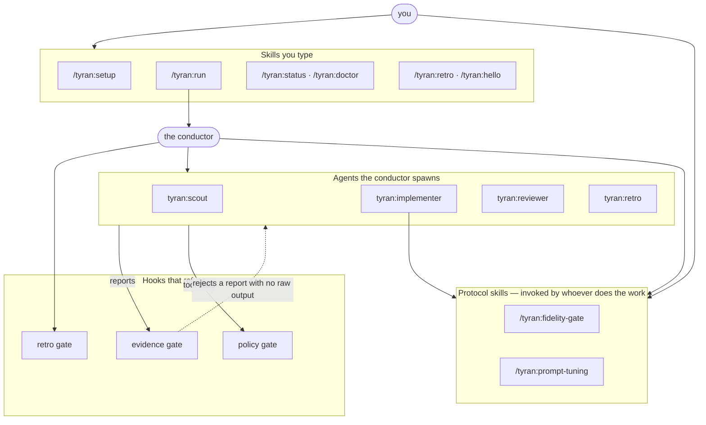

import Provenance from '../../components/Provenance.astro';

<Provenance>
`skills/` · `agents/`
</Provenance>

Tyran is usually described as a conductor, which undersells it. Installing the
plugin also installs **eight skills** and **four agents** — and the skills are
not the conductor's private plumbing. Most of them are things *you* type. There
is no orchestration involved in `/tyran:doctor`; it is a diagnostic you run
because you want to know whether your gates can fire.

Two of the eight are not about Tyran at all. `fidelity-gate` and
`prompt-tuning` are working protocols for problems that have nothing to do with
agent orchestration, and they are the clearest case for reading this page: they
exist because a rule written as prose was demonstrably not enough.

## The eight skills

Every skill is invoked as `/tyran:<name>`. "Who" says whether the caller is
normally a person, the conductor, or either.

| Skill | Role — why it exists | Assumes | Who |
|---|---|---|---|
| [`run`](https://github.com/jjanczur/tyran/blob/main/skills/run/SKILL.md) | Carry a task from a one-line fix to a multi-day programme: classify it S/M/L/XL, route each role to a cost tier, drive the agents, stop only at real decisions. | A repo it may work in, and an operator reachable for the few genuine decisions. Does **not** assume `.tyran/` exists — it can size and run work before setup. | Human |
| [`setup`](https://github.com/jjanczur/tyran/blob/main/skills/setup/SKILL.md) | Configure Tyran for this repository once: scan the stack, the validation commands and the git history, write `.tyran/config.yaml` with provenance on every inferred value. | The repo's own declarations are the evidence — `package.json`, `Makefile`, CI files, merge history. Where it cannot establish a value it asks rather than guesses, and it never infers `P3`. | Human |
| [`status`](https://github.com/jjanczur/tyran/blob/main/skills/status/SKILL.md) | Answer "where is the work" from the journal rather than from memory. Read-only. | An initiative with a journal exists. The answer comes from `journal.jsonl`; anything remembered instead is not an answer. | Either |
| [`doctor`](https://github.com/jjanczur/tyran/blob/main/skills/doctor/SKILL.md) | Diagnose Tyran itself in this repo: gates that cannot fire, journal-vs-projection drift, orphaned leases, dead policy rules, config that fails its schema. Never repairs. | That a dead gate and a healthy gate look identical from inside a session — which is the whole reason it exists. Hooks fail **open**. | Either |
| [`retro`](https://github.com/jjanczur/tyran/blob/main/skills/retro/SKILL.md) | Close an initiative by learning from it: spawn the retrospector over the ledger, the notes and the agents' reports, and record what changed and what was rejected. | A **closed** initiative with a journal and agent reports to read. With no initiative behind it there is no signal, only opinion. | Either — normally the `Stop` gate asks for it |
| [`hello`](https://github.com/jjanczur/tyran/blob/main/skills/hello/SKILL.md) | Installation smoke test: confirm the plugin loaded, that skills are namespaced `/tyran:*`, and where `${CLAUDE_PLUGIN_ROOT}` resolves. | Nothing. It is the one skill that must work before anything else does — and it is the only one marked `disable-model-invocation`, so it runs when you ask and never on a hunch. | Human |
| [`fidelity-gate`](https://github.com/jjanczur/tyran/blob/main/skills/fidelity-gate/SKILL.md) | Build a UI against a frozen visual reference without drift. | A reference that is **frozen and in the repo** — a mockup, a spec, a screenshot — and that the reference, not the ticket prose, is the source of visual truth. | Either |
| [`prompt-tuning`](https://github.com/jjanczur/tyran/blob/main/skills/prompt-tuning/SKILL.md) | Iterate on a prompt, or on anything whose quality is a model's output, without chasing noise. | That the measured quantity is **non-deterministic**. Every rule follows from that one premise; on a deterministic metric the protocol is overkill. | Either |

## The two that are worth a second sentence

These two are the argument of this page, because both were once a rule in prose
and both lost something in that form.

**`fidelity-gate`** splits the work the way the failure demanded: *appearance is
read by a machine, intent is described in words.* Text, typography, colour,
geometry and icons are extracted from the reference mechanically into an
inventory — one row per element — **before the first line of code**, because
every restatement of a design into prose is a lossy copy (`22px/700/#0a2540`
has one interpretation; "large bold dark-blue heading" has hundreds). The
verdict at the end is the filled-in checklist, not a sentence: *"looks
consistent"* is rejected on sight. When this was compressed into three
sentences of general guidance it kept the sentiment and dropped the inventory
step — which is the step that does the work.

**`prompt-tuning`** starts before the first edit, with a **noise baseline**:
same prompt, same inputs, at least two runs, recording the spread. A change
smaller than that spread is noise. Comparisons are medians over **three or more
runs per input**. The rule with the widest reach is that a rule *in* a prompt
is only a request — enforcement is a mechanism that runs **after** generation,
a gate plus a targeted regeneration. Kept as a bare principle, it survived and
everything it was distilled from did not, which is why the measured costs are
still attached to each rule here.

## The four agents

Each is spawned as `tyran:<name>`. The conductor spawns them on L/XL work; you
can also address one directly when you want exactly that mode of work. The
[roster page](../agents/) covers tool grants and model routing.

| Agent | Role — why it exists | Assumes | Who |
|---|---|---|---|
| [`scout`](https://github.com/jjanczur/tyran/blob/main/agents/scout.md) | Fast, cheap reconnaissance over a repo, its data or external sources. Changes nothing. | That a finding is a claim **plus its proof** — every line comes back as `finding -> path:line` or a URL. "I did not find it" is a valid answer; a guess is not. | Conductor, and you |
| [`implementer`](https://github.com/jjanczur/tyran/blob/main/agents/implementer.md) | Take one self-contained story from plan to commit or PR on its own branch, with tests and a self-review. | A story that is genuinely self-contained, a directory it owns (a worktree when the team runs in parallel), and that the handoff's premises may be **wrong** — it verifies them in the code and reports corrections. | Conductor |
| [`reviewer`](https://github.com/jjanczur/tyran/blob/main/agents/reviewer.md) | Independent quality control on **another** agent's diff: its own verification run, not the author's report. Returns APPROVE or CHANGES-REQUESTED with executable counterexamples. | That it never reviews its own code. It ships without `Edit`, `Write` or `NotebookEdit` — a reviewer who can fix what they found ends up approving their own patch. | Conductor |
| [`retro`](https://github.com/jjanczur/tyran/blob/main/agents/retro.md) | After an initiative closes, improve **Tyran itself** — the conductor skill, the roster, new skills, scripts, docs. Never product code. | A closed initiative with a ledger and reports, and an anti-bloat filter whose **default answer is to change nothing**. A retro that changes nothing is a correct outcome. | Conductor |

## Where the source is

Every skill is one `SKILL.md` under
[`skills/`](https://github.com/jjanczur/tyran/tree/main/skills) and every agent
one markdown file under
[`agents/`](https://github.com/jjanczur/tyran/tree/main/agents) — no build step,
no code generation. The tables above deliberately do not restate them: a second
copy of a description is a second place for it to drift.
